# Laboratorio de Seguridad de Redes: DMZ, VLANs y Políticas con FortiGate

**Práctica 3 · Infraestructura 1** — Segmentación de red con DMZ, control de acceso por VLAN y seguridad básica de capa 2 sobre PNETLab.


| | |
|---|---|
| **Estudiante** | Aaron Hernandez |
| **Matrícula** | 2025-0800 |
| **Institución** | Instituto Tecnológico de las Américas (ITLA) |
| **Plataforma** | PNETLab |
| **Fecha de entrega** | 10 de octubre de 2026 |

---

## Video demostrativo

<!-- 👉 PEGA AQUÍ EL ENLACE DE YOUTUBE / ONEDRIVE -->
**▶ [Ver el video demostrativo](https://youtu.be/vItrktH81vk)** · Duración máxima: 10 minutos · Incluye fecha y hora, rostro y voz del autor.

---

## Contenido

1. [Propósito del laboratorio](#1-propósito-del-laboratorio)
2. [Cumplimiento de requisitos](#2-cumplimiento-de-requisitos)
3. [Topología](#3-topología)
4. [Direccionamiento IP](#4-direccionamiento-ip)
5. [Configuración de los switches](#5-configuración-de-los-switches)
6. [Configuración del FortiGate](#6-configuración-del-fortigate)
7. [Servidores de la DMZ](#7-servidores-de-la-dmz)
8. [Usuarios y DHCP](#8-usuarios-y-dhcp)
9. [Pruebas y evidencias](#9-pruebas-y-evidencias)
10. [Problemas encontrados y soluciones](#10-problemas-encontrados-y-soluciones)
11. [Consideraciones de seguridad y mejoras](#11-consideraciones-de-seguridad-y-mejoras)
12. [Estructura del repositorio](#12-estructura-del-repositorio)
13. [Cómo reproducir el laboratorio](#13-cómo-reproducir-el-laboratorio)

---

## 1. Propósito del laboratorio

Este laboratorio simula la red de una organización pequeña con un sistema de **Caja**, un sistema de **Inventario** y una **base de datos**, y demuestra cómo protegerla aplicando el principio de **mínimo privilegio** con un firewall FortiGate.

**Objetivos:**

- Aislar los servidores en una **DMZ** separada de las redes de usuarios.
- Impedir cualquier fuga de tráfico desde la DMZ hacia la LAN.
- Limitar la salida a Internet de la DMZ **únicamente** a los endpoints de actualización de los servicios utilizados.
- Permitir el acceso **SSH** a los servidores solo desde la **VLAN 20**.
- Restringir a la **VLAN 10** el acceso al Sistema de Inventario, mostrando al usuario que violó una política.
- Aplicar seguridad básica de red en los switches (VLAN, port-security, BPDU Guard, trunk restringido).

> Toda la configuración y demostración del FortiGate se realizó por **GUI**. La consola se usó únicamente para el arranque inicial (asignar IP a `port1` y habilitar HTTPS para alcanzar la GUI) y, en modo solo lectura, para verificar resultados.

---

## 2. Cumplimiento de requisitos

| Requisito | Implementación | Sección |
|---|---|---|
| LAN de servidores en una DMZ | `port3` con rol DMZ (10.8.27.0/28) conectado a SW-DMZ (VLAN 30) | [6.1](#61-interfaces), [5.2](#52-sw-dmz) |
| Evitar fuga de tráfico hacia la LAN | Política 6 `DMZ-a-LAN-DENY` (con log); ninguna política permite `port3` → VLAN10/VLAN20 ni tráfico entre VLAN 10 y 20 | [6.6](#66-políticas-de-firewall) |
| DMZ sin acceso abierto a Internet | Solo salen las políticas 4 y 5; la política 7 `DMZ-a-Internet-DENY` bloquea el resto | [6.6](#66-políticas-de-firewall) |
| DMZ solo a endpoints de actualización | Política 4: HTTP/HTTPS hacia `archive.ubuntu.com` y `security.ubuntu.com`; política 5: DNS hacia `8.8.8.8` | [6.4](#64-objetos-de-direcciones), [6.6](#66-políticas-de-firewall) |
| VLAN 20 única con SSH a los servidores | Política 3 `VLAN20-SSH-DMZ` (servicio SSH, origen VLAN20) | [6.6](#66-políticas-de-firewall) |
| VLAN 10 restringida al Sistema de Inventario | Política 2 con perfil Web Filter `Bloqueo-Inventario` que bloquea `10.8.27.3` y muestra la página de bloqueo | [6.5](#65-web-filter) |
| 2 switches con VLAN | SW-Usuarios (VLAN 10 y 20) y SW-DMZ (VLAN 30) | [5](#5-configuración-de-los-switches) |
| Seguridad básica de redes | Port-security, BPDU Guard, PortFast, trunk restringido, DTP desactivado, puerto sin uso apagado | [5.3](#53-medidas-de-seguridad-aplicadas) |
| 3 servidores en /28 | Web-Caja, Web-Inventario y DB-Server en 10.8.27.0/28 | [7](#7-servidores-de-la-dmz) |
| 2 usuarios en /25 con VLAN 10/20 y DHCP | PC-Usuario-10 y PC-Usuario-20 con DHCP del FortiGate | [8](#8-usuarios-y-dhcp) |
| Repositorio con scripts y running-configs | Carpetas `scripts/` y `running-configs/` | [12](#12-estructura-del-repositorio) |

---

## 3. Topología

### 3.1 Diagrama lógico

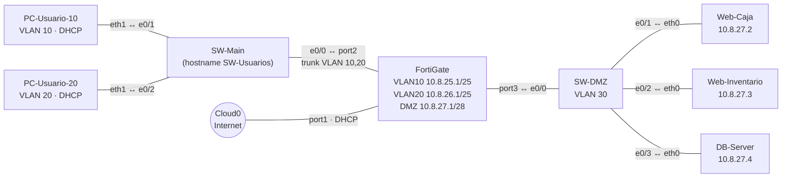

Los nombres coinciden con los nodos de PNETLab.

### 3.2 Diagrama de flujos permitidos y denegados

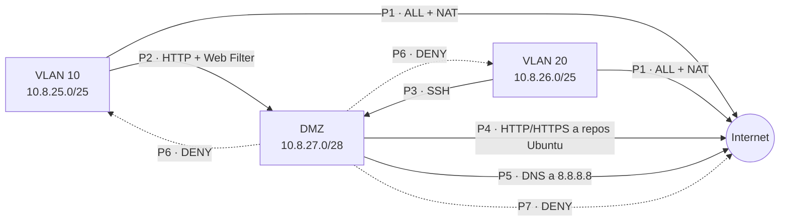

### 3.3 Topología en PNETLab

<!-- CAPTURA 01 -->
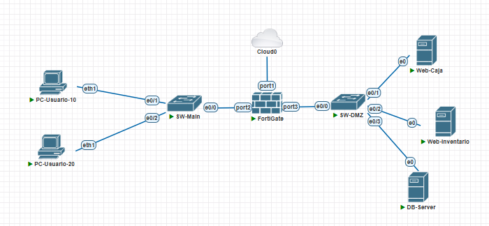
*Figura 1 — Topología completa en PNETLab con todos los nodos encendidos.*

### 3.4 Dispositivos

| Dispositivo | Nodo en PNETLab | Tipo | Función |
|---|---|---|---|
| FortiGate | FortiGate | QEMU · FortiGate-VM64-KVM | Firewall, NAT, DHCP, enrutamiento entre VLAN y políticas |
| SW-Usuarios | SW-Main | IOL · Cisco IOS 15.2 | Switch de acceso de usuarios (VLAN 10 y 20) |
| SW-DMZ | SW-DMZ | IOL · Cisco IOS 15.2 | Switch de la DMZ (VLAN 30) |
| PC-Usuario-10 | PC-Usuario-10 | Docker | Cliente de la VLAN 10 |
| PC-Usuario-20 | PC-Usuario-20 | Docker | Cliente de la VLAN 20 |
| Web-Caja | Web-Caja | QEMU · Ubuntu Server 20.04 | Web Server: Sistema de Caja |
| Web-Inventario | Web-Inventario | QEMU · Ubuntu Server 20.04 | Web Server: Sistema de Inventario |
| DB-Server | DB-Server | QEMU · Ubuntu Server 20.04 | Servidor de base de datos |

### 3.5 Tabla de conexiones

| # | Dispositivo A | Puerto | Dispositivo B | Puerto | Tipo de enlace |
|---|---|---|---|---|---|
| 1 | FortiGate | port1 | Cloud0 (Internet) | — | WAN por DHCP |
| 2 | FortiGate | port2 | SW-Usuarios | e0/0 | Trunk 802.1Q (VLAN 10, 20) |
| 3 | SW-Usuarios | e0/1 | PC-Usuario-10 | eth1 | Access VLAN 10 |
| 4 | SW-Usuarios | e0/2 | PC-Usuario-20 | eth1 | Access VLAN 20 |
| 5 | FortiGate | port3 | SW-DMZ | e0/0 | Access VLAN 30 |
| 6 | SW-DMZ | e0/1 | Web-Caja | eth0 | Access VLAN 30 |
| 7 | SW-DMZ | e0/2 | Web-Inventario | eth0 | Access VLAN 30 |
| 8 | SW-DMZ | e0/3 | DB-Server | eth0 | Access VLAN 30 |

---

## 4. Direccionamiento IP

El direccionamiento se derivó de la matrícula **2025-0800**, con el esquema `10.8.X.0`.

| Segmento | Red | Máscara | Gateway | Hosts / Rango |
|---|---|---|---|---|
| VLAN 10 · Usuarios | 10.8.25.0/25 | 255.255.255.128 | 10.8.25.1 | DHCP 10.8.25.10 – 10.8.25.120 |
| VLAN 20 · Usuarios | 10.8.26.0/25 | 255.255.255.128 | 10.8.26.1 | DHCP 10.8.26.10 – 10.8.26.120 |
| DMZ (VLAN 30) | 10.8.27.0/28 | 255.255.255.240 | 10.8.27.1 | Web-Caja .2 · Web-Inventario .3 · DB-Server .4 |
| WAN | Asignada por DHCP (Cloud0) | — | — | `port1` (p. ej. 192.168.159.150/24 durante las pruebas) |

---

## 5. Configuración de los switches

Los running-configs completos están en [`running-configs/`](running-configs/).

### 5.1 SW-Usuarios

- VLAN 10 (`USUARIOS-10`) y VLAN 20 (`USUARIOS-20`).
- `Ethernet0/0`: trunk 802.1Q hacia `port2` del FortiGate, permitiendo solo las VLAN 10 y 20.
- `Ethernet0/1` y `Ethernet0/2`: puertos de acceso para cada PC con port-security.
- `Ethernet0/3`: sin uso, en la VLAN 999 y apagado.

```
interface Ethernet0/0
 description Trunk hacia FortiGate port2
 switchport trunk allowed vlan 10,20
 switchport trunk encapsulation dot1q
 switchport mode trunk
 switchport nonegotiate
!
interface Ethernet0/1
 description PC-Usuario-10
 switchport access vlan 10
 switchport mode access
 switchport port-security violation restrict
 switchport port-security
 spanning-tree portfast edge
 spanning-tree bpduguard enable
```

<!-- CAPTURA 02 -->
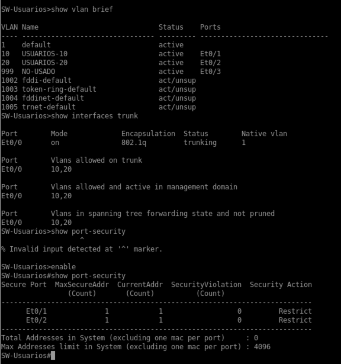
*Figura 2 — SW-Usuarios: `show vlan brief`, `show interfaces trunk` y `show port-security`.*

### 5.2 SW-DMZ

- VLAN 30 (`DMZ`).
- `Ethernet0/0`: enlace hacia `port3` del FortiGate (acceso VLAN 30).
- `Ethernet0/1` a `Ethernet0/3`: servidores, con port-security, PortFast y BPDU Guard.

```
interface Ethernet0/0
 description Uplink hacia FortiGate port3
 switchport access vlan 30
 switchport mode access
!
interface Ethernet0/1
 description Servidor DMZ
 switchport access vlan 30
 switchport mode access
 switchport port-security violation restrict
 switchport port-security
 spanning-tree portfast edge
 spanning-tree bpduguard enable
```

> En los switches IOL las VLAN se guardan en `vlan.dat`, por eso no aparecen en el `running-config`. La evidencia es la salida de `show vlan brief`.

<!-- CAPTURA 03 -->
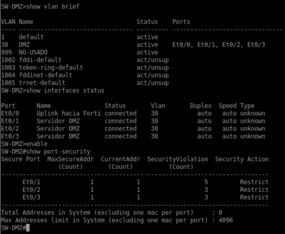
*Figura 3 — SW-DMZ: `show vlan brief`, `show interfaces status` y `show port-security`.*

### 5.3 Medidas de seguridad aplicadas

| Medida | Dónde | Propósito |
|---|---|---|
| Port-security (máx. 1 MAC, violación `restrict`) | Puertos de usuario y de servidores | Evita conectar equipos no autorizados |
| BPDU Guard + PortFast | Puertos de usuario y de servidores | Evita bucles y switches no autorizados en puertos de acceso |
| Trunk restringido a VLAN 10 y 20 | SW-Usuarios `e0/0` | Solo viajan las VLAN necesarias |
| DTP desactivado (`nonegotiate`) | SW-Usuarios `e0/0` | Evita negociación de trunk no autorizada |
| Puerto sin uso apagado y en VLAN 999 | SW-Usuarios `e0/3` | Reduce la superficie de ataque |
| Rapid-PVST | Ambos | Convergencia rápida de spanning-tree |
| Servicios HTTP del switch deshabilitados | Ambos | Reduce servicios expuestos |

---

## 6. Configuración del FortiGate

Configurado y demostrado por **GUI**. Running-config completo: [`running-configs/FortiGate.txt`](running-configs/FortiGate.txt).

### 6.1 Interfaces

| Interfaz | Rol | Dirección IP | Acceso administrativo | Notas |
|---|---|---|---|---|
| `port1` | WAN | DHCP | ping, https, ssh, http | Salida a Internet por Cloud0 |
| `port2` | LAN | Sin IP | — | Tronco hacia SW-Usuarios |
| `VLAN10` (sobre `port2`, ID 10) | LAN | 10.8.25.1/25 | ping | Gateway y servidor DHCP de la VLAN 10 |
| `VLAN20` (sobre `port2`, ID 20) | LAN | 10.8.26.1/25 | — | Gateway y servidor DHCP de la VLAN 20 |
| `port3` | DMZ | 10.8.27.1/28 | ping | Gateway de la DMZ, sin DHCP |

**Arranque inicial por consola** (único paso fuera de la GUI, necesario para alcanzar la interfaz web):

```
config system interface
    edit "port1"
        set mode dhcp
        set allowaccess ping https ssh http
    next
end
```

### 6.2 DNS

`Network > DNS`: primario `8.8.8.8`, secundario `1.1.1.1`.

### 6.3 Servidores DHCP

| Interfaz | Rango | Gateway | DNS |
|---|---|---|---|
| `VLAN10` | 10.8.25.10 – 10.8.25.120 | 10.8.25.1 | DNS del sistema |
| `VLAN20` | 10.8.26.10 – 10.8.26.120 | 10.8.26.1 | DNS del sistema |

### 6.4 Objetos de direcciones

`Policy & Objects > Addresses`

| Nombre | Tipo | Valor |
|---|---|---|
| `UPD-archive` | FQDN | `archive.ubuntu.com` |
| `UPD-security` | FQDN | `security.ubuntu.com` |
| `DNS-Google` | Subnet | `8.8.8.8/32` |
| `Web-Caja` | Subnet | `10.8.27.2/32` |
| `Web-Inventario` | Subnet | `10.8.27.3/32` |
| `DB-Server` | Subnet | `10.8.27.4/32` |

### 6.5 Web Filter

`Security Profiles > Web Filter` → perfil **`Bloqueo-Inventario`**, con un **Static URL Filter** que bloquea la URL `10.8.27.3` (Web-Inventario). El perfil se aplica en la política 2, de modo que cuando un usuario de la VLAN 10 intenta abrir el Sistema de Inventario, el FortiGate le muestra la **página de bloqueo** y registra el evento.

<!-- CAPTURA 04 -->
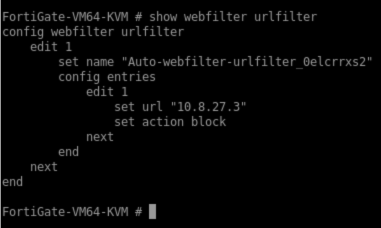
*Figura 4 — Perfil Bloqueo-Inventario con el Static URL Filter (`10.8.27.3` en Block).*

### 6.6 Políticas de firewall

`Policy & Objects > Firewall Policy` — el orden importa: las políticas de permiso van antes de las de denegación.

| # | Nombre | Origen → Destino | Direcciones destino | Servicio | Acción | NAT | Seguridad / Log |
|---|---|---|---|---|---|---|---|
| 1 | `LAN-a-Internet` | VLAN10, VLAN20 → port1 | all | ALL | ACCEPT | Sí | — |
| 2 | `VLAN10-a-Web` | VLAN10 → port3 | Web-Caja, Web-Inventario | HTTP | ACCEPT | No | Web Filter `Bloqueo-Inventario` · Log: all |
| 3 | `VLAN20-SSH-DMZ` | VLAN20 → port3 | Web-Caja, Web-Inventario, DB-Server | SSH | ACCEPT | No | Log: all |
| 4 | `DMZ-Updates` | port3 → port1 | UPD-archive, UPD-security | HTTP, HTTPS | ACCEPT | Sí | — |
| 5 | `DMZ-DNS` | port3 → port1 | DNS-Google | DNS | ACCEPT | Sí | — |
| 6 | `DMZ-a-LAN-DENY` | port3 → VLAN10, VLAN20 | all | ALL | DENY | — | Log: all |
| 7 | `DMZ-a-Internet-DENY` | port3 → port1 | all | ALL | DENY | — | Log: all |

**Lógica de seguridad:**

- La VLAN 10 solo alcanza la DMZ por **HTTP**, y el Inventario queda bloqueado por el Web Filter.
- La VLAN 20 es la **única** con **SSH** hacia los servidores.
- La DMZ solo sale a Internet hacia los repositorios de Ubuntu (HTTP/HTTPS) y al DNS `8.8.8.8`; todo lo demás se deniega explícitamente (política 7).
- Nada permite el tráfico DMZ → LAN (política 6) ni entre VLAN 10 y VLAN 20, por lo que se aplica la denegación implícita.

<!-- CAPTURA 05 -->
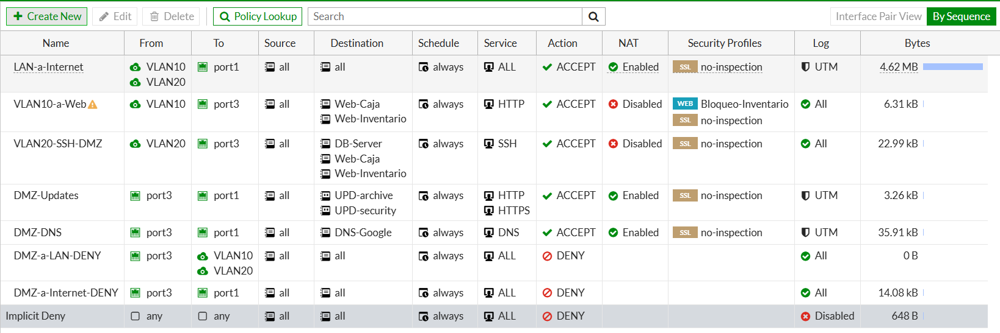
*Figura 5 — Policy & Objects > Firewall Policy con las 7 políticas.*

### 6.7 Registros

Las políticas 2, 3, 6 y 7 tienen el registro de tráfico completo, lo que permite mostrar los eventos en `Log & Report > Forward Traffic`.

---

## 7. Servidores de la DMZ

| Servidor | IP | Servicios | Puerto en SW-DMZ |
|---|---|---|---|
| Web-Caja | 10.8.27.2/28 | Apache2, OpenSSH | e0/1 |
| Web-Inventario | 10.8.27.3/28 | Apache2, OpenSSH | e0/2 |
| DB-Server | 10.8.27.4/28 | MariaDB, OpenSSH | e0/3 |

Cada servidor se prepara con el script [`scripts/setup.sh`](scripts/setup.sh), que:

1. Instala los servicios del rol (Apache2 o MariaDB) y OpenSSH.
2. Publica una página identificando el sistema (en los servidores web).
3. Crea el usuario `admin` y habilita SSH por contraseña.
4. Reemplaza los mirrors regionales de Ubuntu por `archive.ubuntu.com` en `sources.list`.
5. Fija la IP estática, el gateway `10.8.27.1` y el DNS en Netplan, y desactiva la red de cloud-init.
6. Apaga el equipo para moverlo a SW-DMZ.

**Uso** (antes de ejecutarlo, cambiar la variable `CLAVE`; la clave real no se publica en el repositorio):

```bash
sudo bash setup.sh caja          # Web-Caja
sudo bash setup.sh inventario    # Web-Inventario
sudo bash setup.sh db            # DB-Server
```

Los servidores se instalan temporalmente conectados a Cloud0 y, una vez apagados, se conectan a SW-DMZ.


---

## 8. Usuarios y DHCP

Los PCs son contenedores Docker de PNETLab conectados por `eth1`. Reciben la IP del servidor DHCP del FortiGate y después se fija la ruta por defecto y el DNS:

```bash
dhclient -v eth1
ip route replace default via 10.8.25.1 dev eth1     # VLAN 10 (en la VLAN 20: 10.8.26.1)
echo "nameserver 8.8.8.8" > /etc/resolv.conf
```

Resultado en PC-Usuario-10: `DHCPOFFER of 10.8.25.10 from 10.8.25.1` → `bound to 10.8.25.10`.

---

## 9. Pruebas y evidencias

| # | Prueba | Desde | Comando | Resultado esperado |
|---|---|---|---|---|
| T1 | Acceso a Internet de los usuarios | PC-Usuario-10 | `ping -c2 8.8.8.8` | Responde |
| T2 | Acceso al Sistema de Caja | PC-Usuario-10 | `curl -s http://10.8.27.2` | Muestra "Sistema de Caja" |
| T3 | Acceso al Sistema de Inventario | PC-Usuario-10 | `curl -s http://10.8.27.3 \| sed 's/<[^>]*>//g' \| grep -v '^\s*$' \| head` | Página de **bloqueo** del FortiGate |
| T4 | SSH desde la VLAN 10 | PC-Usuario-10 | `ssh -o ConnectTimeout=5 admin@10.8.27.2` | Falla (sin respuesta) |
| T5 | SSH desde la VLAN 20 | PC-Usuario-20 | `ssh admin@10.8.27.2` · `.3` · `.4` | Entra a los tres servidores |
| T6 | Actualizaciones permitidas | Servidor DMZ | `curl -sI http://archive.ubuntu.com \| head -1` | Responde `HTTP/1.1 ...` |
| T7 | Internet general bloqueado | Servidor DMZ | `curl -sI --max-time 5 http://example.com` | Sin respuesta |
| T8 | Sin fuga hacia la LAN | Servidor DMZ | `ping -c2 -W2 10.8.25.1` | Sin respuesta |
| T9 | Registros de denegación | FortiGate (GUI) | `Log & Report > Forward Traffic` (Action = Deny) | Eventos de las políticas 6 y 7 |

### Evidencias

**VLAN 10 (T1–T4):** IP por DHCP, Internet, acceso a Web-Caja, página de bloqueo del Inventario y SSH sin respuesta.

<!-- CAPTURA 06 -->
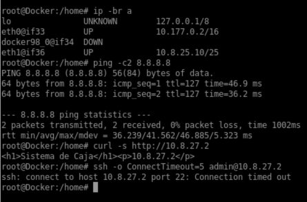
*Figura 6 — PC-Usuario-10: `ip -br a`, `ping`, `curl` a Web-Caja y a Web-Inventario (página de bloqueo) y `ssh` sin respuesta.*

**VLAN 20 (T5):** SSH permitido hacia los tres servidores.

<!-- CAPTURA 07 -->
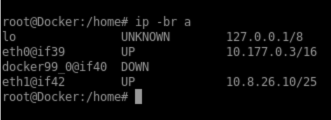
*Figura 7 — PC-Usuario-20: `ip -br a` y SSH hacia 10.8.27.2, .3 y .4.*

**DMZ (T6–T8):** solo salen los endpoints de actualización; el resto de Internet y la LAN quedan bloqueados.

<!-- CAPTURA 08 -->
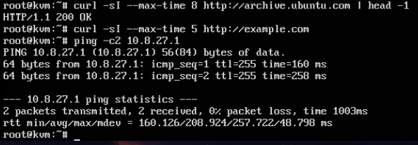
*Figura 8 — Servidor de la DMZ: `curl` a archive.ubuntu.com (responde) y a example.com y `ping` a la LAN (sin respuesta).*

**Registros (T9):** eventos de denegación en el FortiGate.

<!-- CAPTURA 09 -->
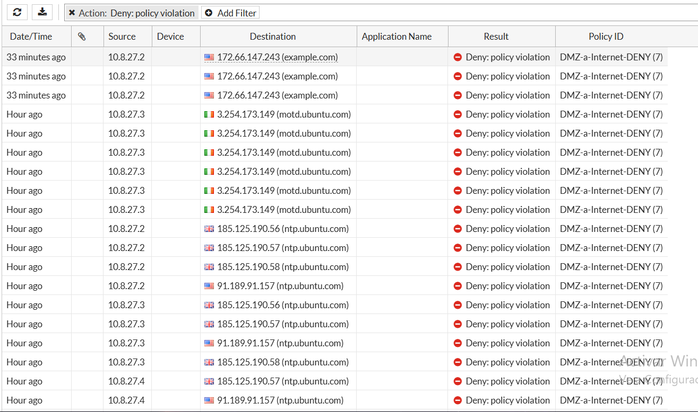
*Figura 9 — Log & Report > Forward Traffic filtrado por Action = Deny.*

---

## 10. Problemas encontrados y soluciones

| Problema | Causa | Solución |
|---|---|---|
| Web-Caja no alcanzaba su gateway (`Destination Host Unreachable`) | El port-security de SW-DMZ conservaba una MAC antigua del servidor; la MAC actual generaba `PSECURE_VIOLATION` y el switch descartaba su tráfico | Reiniciar los puertos (`shutdown` / `no shutdown`) para borrar las MAC aprendidas y verificar con `show port-security address` |

---


## 11. Estructura del repositorio

```
.
├── README.md
├── images/                    # Capturas del laboratorio
├── scripts/
│   └── setup.sh               # Preparación de los servidores de la DMZ
└── running-configs/
    ├── FortiGate.txt
    ├── SW-Usuarios.txt
    └── SW-DMZ.txt
```

---


**Autor:** Aaron Hernández · Matrícula 2025-0800 · ITLA
